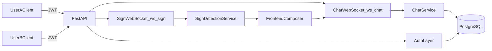

# Kế hoạch hoàn thiện chat 1-1 realtime

## Mục tiêu
Xây dựng nền chat 1-1 cơ bản nhưng đúng chuẩn production-lite cho dự án hiện tại: đăng nhập JWT, nhắn tin realtime, lấy lịch sử theo cặp user có phân trang, đánh dấu đã đọc, sửa/thu hồi, và tích hợp nhận diện ký hiệu như một nguồn nhập tin trong cùng luồng chat.

## Kiến trúc đề xuất (phù hợp codebase hiện tại)
- Giữ FastAPI một service backend (đang ở [`backend/realtime_optimized.py`](backend/realtime_optimized.py)), tách module theo router/service để tránh file phình to.
- Chuyển phần DB sang SQLModel async (PostgreSQL) để đồng nhất với websocket realtime và giảm block event loop.
- Dùng auth đơn giản: `users` + password hash + JWT access token.
- Tách websocket thành 2 kênh chức năng:
  - `ws/sign` cho luồng nhận diện ký hiệu (di chuyển logic từ `/ws` hiện tại).
  - `ws/chat` cho luồng message realtime theo `user_id` đã xác thực.
- Frontend giữ mức cơ bản: 1 màn hình chat, danh sách tin nhắn, composer text + nhận diện ký hiệu chèn vào composer.

## Thiết kế dữ liệu chat
Mở rộng từ model hiện có [`backend/models.py`](backend/models.py):
- `User`
  - `id (uuid)`, `username (unique)`, `password_hash`, `created_at`, `last_seen_at`
- `Conversation`
  - `id (uuid)`, `user_a_id`, `user_b_id`, `created_at`, `last_message_at`
  - unique pair `(min(user_a_id,user_b_id), max(...))`
- `Message`
  - `id (uuid)`, `conversation_id`, `sender_id`, `receiver_id`
  - `content`, `message_type` (`text|sign_text`)
  - `status` (`sent|delivered|read`)
  - `created_at`, `updated_at`, `deleted_at`, `edited_at`
  - `is_recalled` (bool), `version` (int)
- `MessageEditHistory`
  - `id`, `message_id`, `old_content`, `new_content`, `edited_by`, `edited_at`

## API/Realtime contract (MVP)
HTTP cơ bản:
- `POST /auth/register`
- `POST /auth/login`
- `GET /messages/{peer_id}?cursor=<iso_ts_or_id>&limit=20` (theo cặp user, newest-first, cursor pagination)
- `PATCH /messages/{message_id}` (sửa tin, chỉ sender, tạo history)
- `POST /messages/{message_id}/recall` (thu hồi mềm)
- `POST /messages/read` (mark read theo conversation/đến message id)

WebSocket:
- `GET /ws/chat?token=...`
  - event gửi: `message.send`, `message.edit`, `message.recall`, `message.read`
  - event nhận: `message.new`, `message.updated`, `message.recalled`, `message.read_receipt`, `presence` (tối thiểu online/offline)
- `GET /ws/sign?token=...`
  - giữ payload nhận diện hiện có (`stable_word`, `candidate_signs`), frontend cho phép thêm nhanh vào composer chat.

## Quy tắc nghiệp vụ mặc định
- Độ dài tin: `1..2000` ký tự sau trim.
- Không cho gửi rỗng/whitespace-only.
- Chống spam: tối đa `5 tin/5 giây/user` (token bucket in-memory cho MVP; nâng Redis sau).
- Thứ tự hiển thị: `created_at ASC` trong UI, query backend lấy `DESC` + đảo chiều khi render.
- Timezone: lưu UTC trong DB, frontend hiển thị local timezone của client.
- Quyền sửa/thu hồi: chỉ sender, trong cửa sổ 24h (có thể cấu hình).

## Tích hợp frontend cơ bản
Dựa trên các file hiện có [`frontend/src/app/page.tsx`](frontend/src/app/page.tsx), [`frontend/src/components/CameraFeed.tsx`](frontend/src/components/CameraFeed.tsx), [`frontend/src/components/DetectionResults.tsx`](frontend/src/components/DetectionResults.tsx):
- Tách UI chat thành component riêng (`ChatWindow`, `MessageList`, `MessageComposer`).
- Chuyển lịch sử cục bộ ở `DetectionResults` sang dữ liệu từ backend.
- Khi `stable_word` xuất hiện, cho nút “Add to message” để thêm vào composer (không auto-send).
- Quản lý token + user session đơn giản (memory + localStorage).

## Trình tự triển khai
1. Chuẩn hóa backend cấu trúc module (`auth`, `chat`, `sign`, `db`) và config môi trường.
2. Tạo migration/schema cho `User/Conversation/Message/MessageEditHistory`.
3. Hoàn thành auth JWT và middleware/dependency lấy current user.
4. Xây HTTP API chat (history phân trang, sửa, thu hồi, đã đọc).
5. Xây `ws/chat` với connection manager theo `user_id`, broadcast đúng peer.
6. Tách `ws/sign` từ logic `/ws` hiện tại, giữ tương thích payload nhận diện.
7. Cập nhật frontend MVP chat + ghép nhận diện ký hiệu vào composer.
8. Thêm test tối thiểu cho auth, permissions, pagination, edit/recall/read.

## Kiểm thử/tiêu chí hoàn tất
- 2 user đăng nhập riêng có thể nhắn realtime qua `ws/chat`.
- Refresh trang vẫn tải đúng lịch sử có phân trang.
- Tin đã sửa hiển thị nhãn “edited”, tin thu hồi hiển thị placeholder “message recalled”.
- Read receipt cập nhật đúng khi peer mở conversation.
- Luồng nhận diện ký hiệu vẫn hoạt động và có thể đẩy từ gợi ý sang composer.
- Không gửi được tin rỗng hoặc vượt giới hạn, spam bị chặn theo rule.